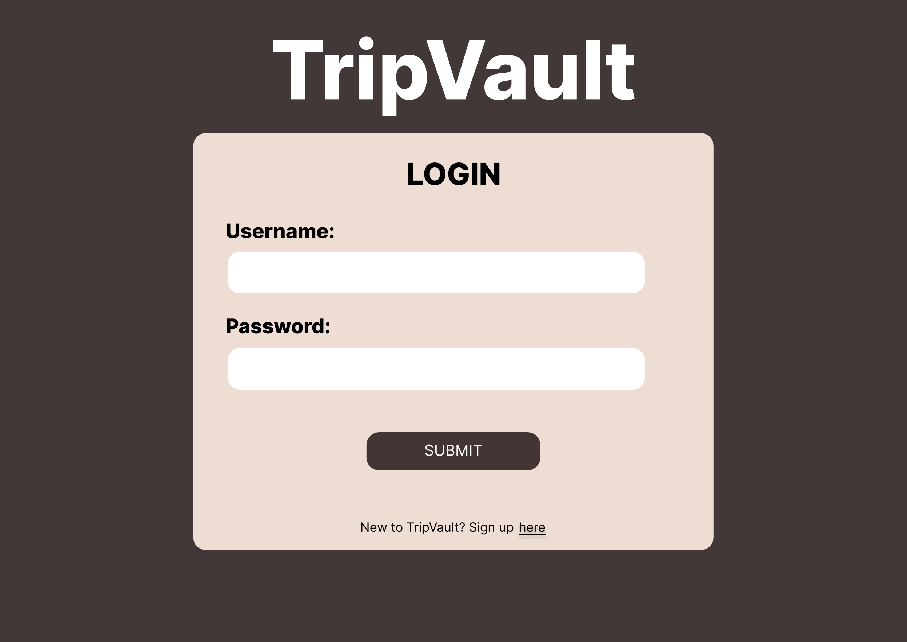
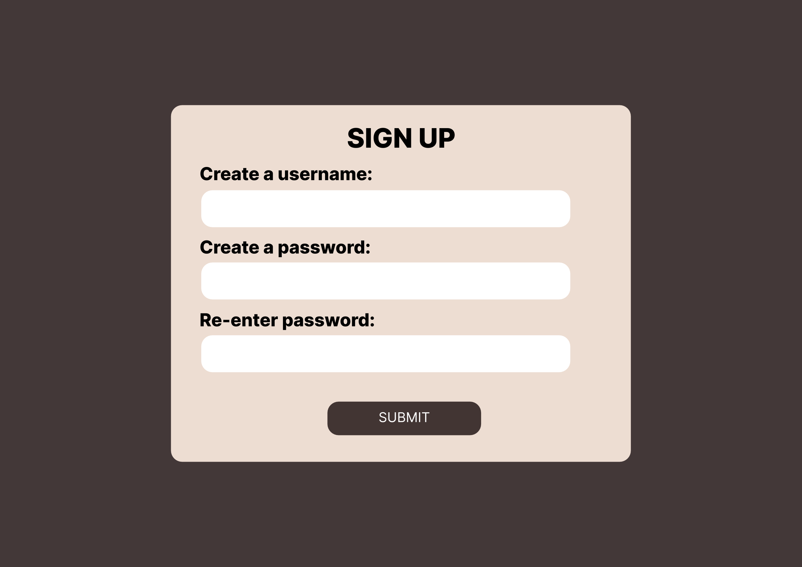
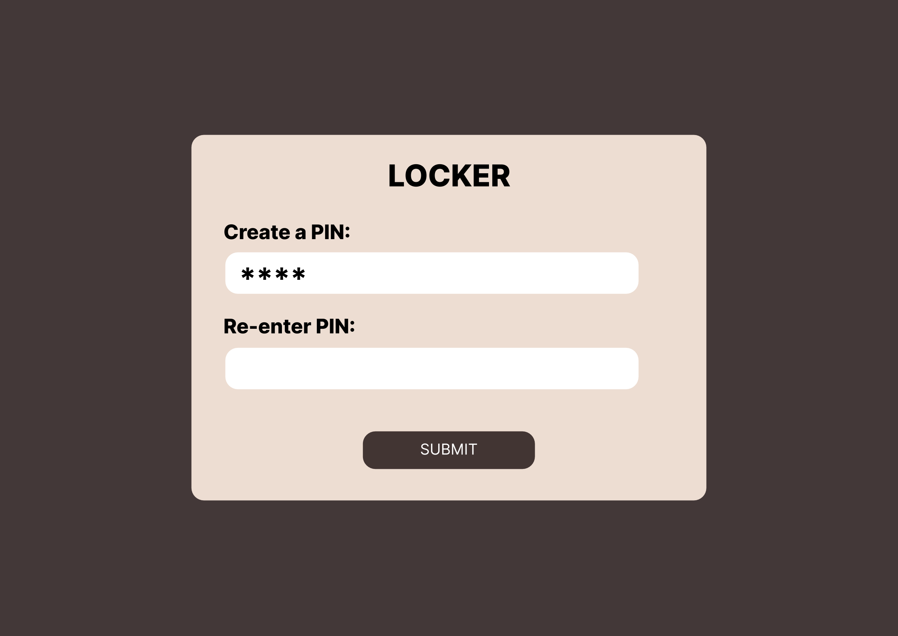
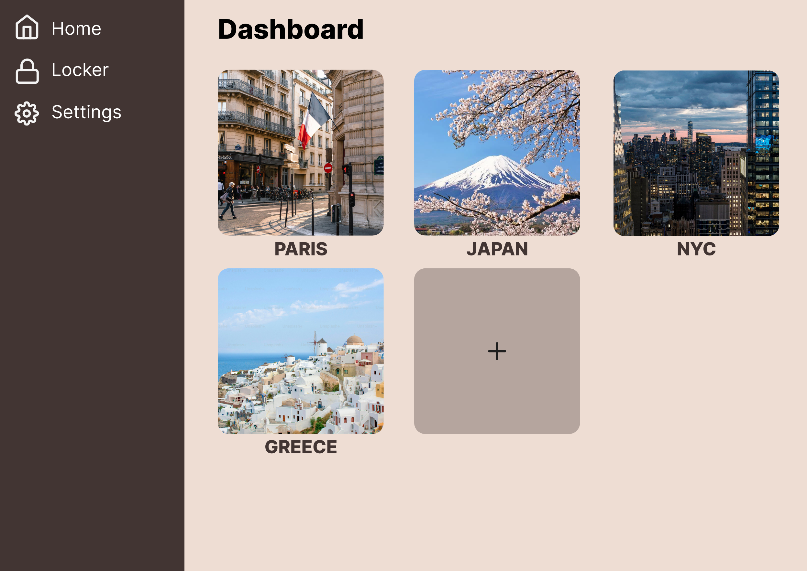
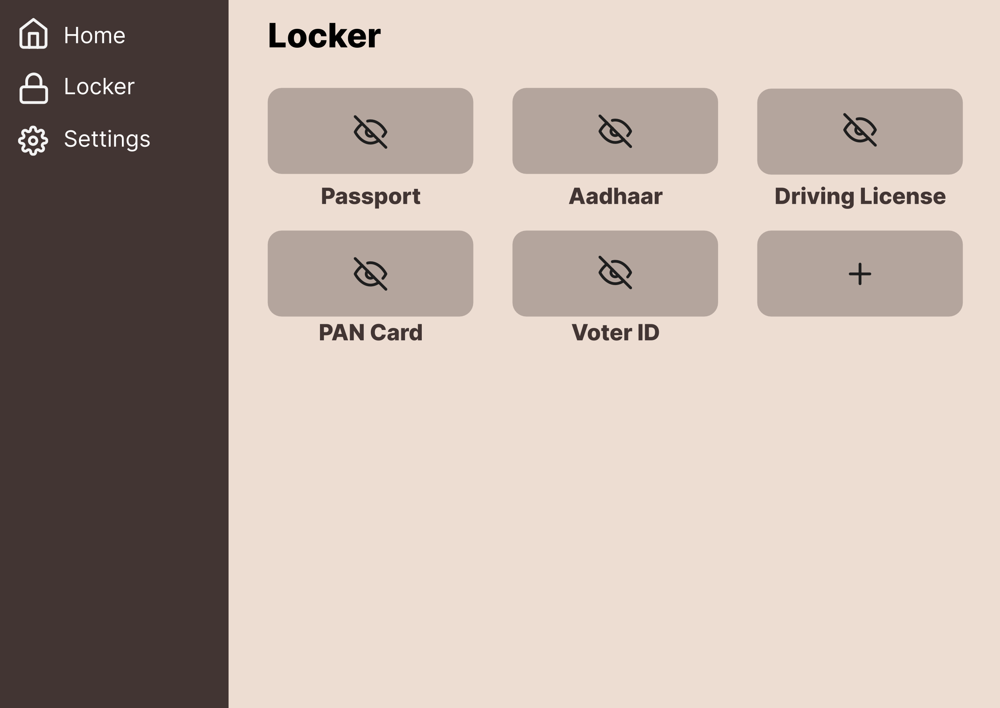
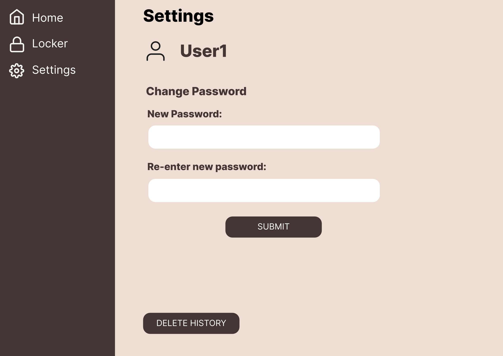
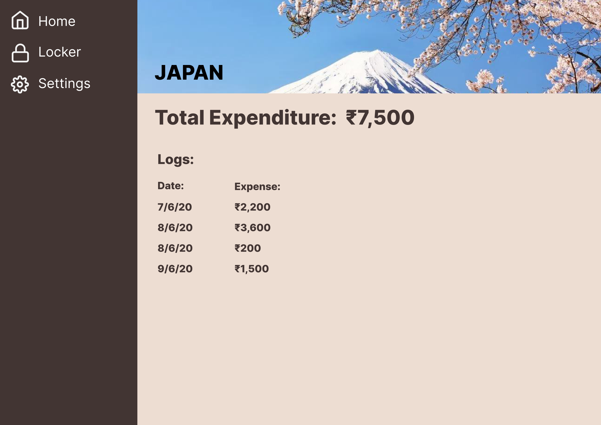

# TripVault

**TripVault** is a travel wallet web app built with the **MERN stack**. It allows users to securely store important travel documents and track daily expenses — all in one place.

## Features
- Organize and tag travel documents
- Log daily trip expenses
- View and manage past journeys
- User profile & settings via hamburger menu

## Tech Stack
- **Frontend**: React
- **Backend**: Node.js, Express
- **Database**: MongoDB

## Getting Started

```bash
# Clone the repository
git clone https://github.com/yourusername/tripvault.git

# Install server dependencies
cd tripvault/server
npm install

# Start the server
npm run dev

# In a new terminal, install client dependencies
cd ../client
npm install

# Start the React frontend
npm start
```









